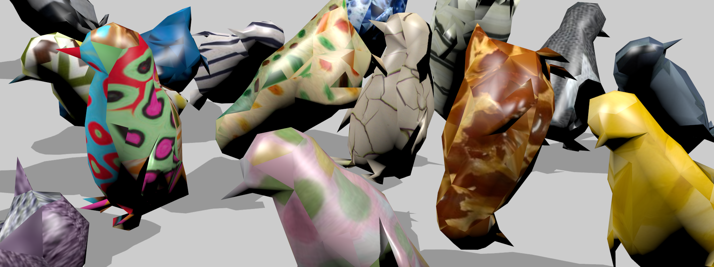

# dr4oc

Code for "Domain Randomization for Object Counting"

Pretrained models available [here](https://drive.google.com/drive/folders/1bYszcFzfbyKIRu5syoUctswmu0U6YChW?usp=sharing). Counting baseline from: https://github.com/cvlab-stonybrook/DM-Count